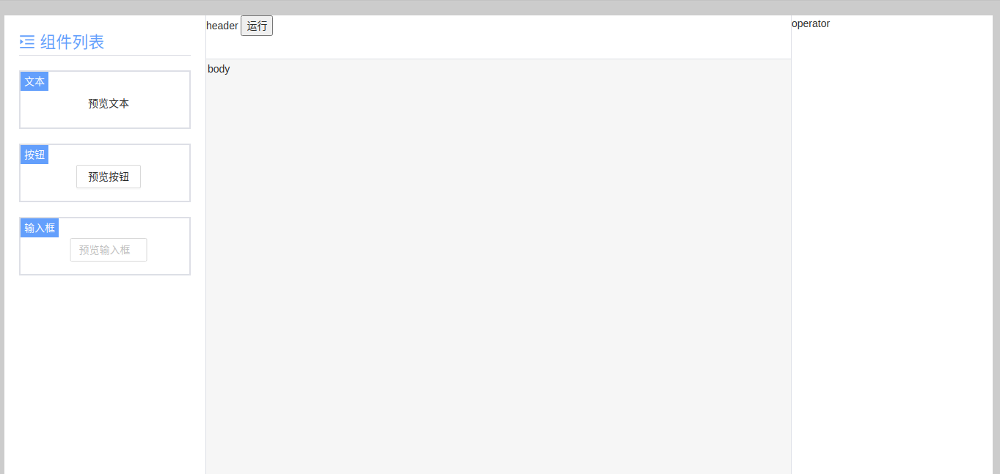
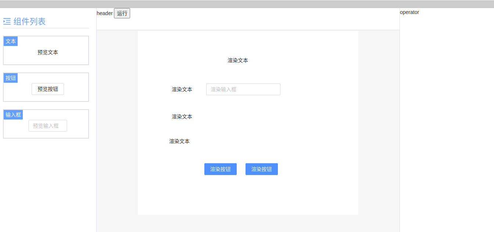

# Vite2 + React17 + Typescript4 + Ant Design 4 可视化拖拽页面编辑器

> 随着大前端的不断发展，越来越解放开发的双手，感觉要失业啦(^_^),针对一些简单模板处理，可直接通过个拖拉拽放，就可简单实现一些不错的 UI 功能。那么 `可视化拖拽页面编辑器` 的出现也是顺应时代的发展而出现。


***最终效果***


# 任务清单

- [X] 主页面结构：左侧菜单栏可选组件列表、中间容器画布、右侧编辑组件定义的属性；
- [X] 左侧菜单栏可选组件列表渲染；
- [ ] 从菜单栏拖拽组件到容器；
- [ ] 组件（Block）在容器的选中状态；
- [ ] 容器内组件可移动位置；
- [ ] 命令队列及对应的快捷键；
- [ ] 容器内的组件单选、多选、全选；
- [ ] 操作栏按钮：
    - [ ] 撤销、重做 **重难点**；
    - [ ] 置顶、置底；
    - [ ] 删除、清空；
    - [ ] 预览、关闭编辑模式；
    - [ ] 导入、导出；
- [ ] 右键菜单；
- [ ] 拖拽粘性贴边；
- [ ] 组件可以拖动调整高度和宽度（height，width）；
- [ ] 组件可以设置预定好的属性（props）；
- [ ] 组件绑定值（model）；  
- [ ] 设置组件标识（soltName），根据这个标识，定义某个组件的行为（函数触发）和插槽的实现（自定义视图）;
- [ ] 完善可选组件列表:
  - [ ] 输入框：双向绑定值，调整宽度；
  - [ ] 按钮：类型、文字、大小尺寸、拖拽调整宽高；
  - [ ] 图片：自定义图片地址、拖拽调整图片宽高
  - [ ] 下拉框：预定义选项值、双向绑定字段；


# 一、项目搭建与页面布局

1. 项目所需依赖：

```json
 "dependencies": {
    "@ant-design/icons": "^4.5.0",
    "antd": "^4.15.0",
    "classnames": "^2.2.6",
    "deepcopy": "^2.1.0",
    "react": "^17.0.1",
    "react-color": "^2.19.3",
    "react-dom": "^17.0.1"
  },
  "devDependencies": {
    "@types/classnames": "^2.2.11",
    "@types/node": "^14.14.37",
    "@types/react": "^17.0.2",
    "@types/react-color": "^3.0.4",
    "@types/react-dom": "^17.0.1",
    "@vitejs/plugin-react-refresh": "^1.3.1",
    "less": "^4.1.1",
    "sass": "^1.42.0",
    "typescript": "^4.1.5",
    "vite": "^2.0.1",
    "vite-plugin-babel-import": "^2.0.5",
    "vite-plugin-style-import": "^1.2.1"
  }
```

2. vite 配置

```js
const path = require('path');
import reactRefresh from '@vitejs/plugin-react-refresh';
import { defineConfig } from 'vite';
import styleImport from 'vite-plugin-style-import';

export default defineConfig({
    plugins: [
        reactRefresh(),
        styleImport({
            libs: [
                {
                    libraryName: 'antd',
                    esModule: true,
                    resolveStyle: (name) => {
                        return `antd/es/${name}/style`;
                    },
                }
            ]
        }),
    ],
    css: {
        preprocessorOptions: {
            less: {
                javascriptEnabled: true
            }
        }
    },
    esbuild: {
        jsxInject: "import React from 'react'", // 为每个 tsx jsx 自动引入 React，不用手动引入了
    },
    resolve: {
        alias: {
            "@": path.resolve(__dirname, "src"),
            "@assets": path.resolve(__dirname, "src/assets"),
            "@components": path.resolve(__dirname, "src/components")
        }
    },
    server: {
        https: false, // 是否开启 https
        open: true, // 是否自动在浏览器打开
        port: 3000, // 端口号
        host: "0.0.0.0",
        hmr: {
            overlay: true, // 是否开启错误的阴影层
        }
    },
    optimizeDeps: {
        include: [] // 第三方库
    },
    build: {
        chunkSizeWarningLimit: 2000,
        terserOptions: {
            // 生产环境移除 console
            compress: {
                drop_console: true,
                drop_debugger: true,
            },
        },
        rollupOptions: {
            output:{
                manualChunks: { // 分包
                    react: ['react', 'react-dom'],
                    antd: ['antd']
                }
            }
        }
    }
})
```


### 实现基本的左中右布局（）

- 左侧是组件列表的菜单栏
- 中间是画布容器和顶部的工具栏，用来编辑和预览页面
- 右侧是对应画布容器中某个组件，对应显示的该组件的属性配置

这布局下相对简单就脑补一下下吧 ^_^


# 二、基本数据结构设计

> 针对于一个画布容器与组件的关系，对应一个画布大小变化，和一个画布中对应多个组件，一个组件配置相关信息，对于拖拽大家一定想到，**定位**，如果优化，可以使用 CSS3 的属性 `transform` 的 `translateX`,` translateY`优化。这里暂时不做处理。

- 定义数据结构
  - container：画布容器信息
  - blocks：画布容器中的组件信息
  - blocks中存放每个 block 组件信息，包含了组件的唯一标识、位置、宽高、状态等信息

```tsx
/**
 * 容器中每个元素的的数据类型
 */
export interface VisualEditorBlock {
  componentKey: string, // component 对象的的 key 唯一标识
  top: number, // block 在容器中的 top 位置
  left: number, // block 在容器中的 left 位置
  width: number, // block 组件自身的宽度
  height: number, // block 组件自身的高度
  adjustPosition: boolean, // 添加组件到容器中时是否需要调整位置
  focus: boolean, // 组件是否是选中状态
  zIndex: number,   // block 组件元素的 z-index style 属性
  hasReasize: boolean, // block 组件元素是否曾调整国大小
  props?: Record<string, any> // block 组件元素右侧属性配置信息
  model?: Record<string, any> // 组件元素右侧自定义配置属性信息（绑定值）
  slotName?: string   // 组件标识
}
/**
 * 编辑器编辑的数据类型
 */
export interface VisualEditorValue {
  container: { // 画布容器
    height: number,
    width: number,
  },
  blocks: VisualEditorBlock[]
}
```

[代码传送门](https://github.com/lyios8859-1/react-app-editor-project/commit/25575720ea2b1c13d6572ae8dad41ea1621fd5c5)


# 三、左侧菜单栏可选组件列表渲染

1. 开发注册组件

```tsx
// visual.config.tsx
import { Button, Input } from "antd";
import { createVisualConfig } from "./editor.utils";

export const visualConfig = createVisualConfig();

visualConfig.registryComponent('text', {
    label: '文本',
    prievew: () => <span>预览文本</span>,
    render: () => <span>渲染文本</span>
});

visualConfig.registryComponent('button', {
    label: '按钮',
    prievew: () => <Button>预览按钮</Button>,
    render: () => <Button type="primary">渲染按钮</Button>
});

visualConfig.registryComponent('input', {
    label: '输入框',
    prievew: () => <Input placeholder="预览输入框" />,
    render: () => <Input placeholder="渲染输入框" />
});
```

**注册组件的函数**：

```tsx
/**
 * 创建编辑器的预设内容
 */
export function createVisualConfig() {
    // 用于 block 数据，通过 componentKey 找到 component 对象，使用 component 对象的 render 属性渲染内容到 container 容器里
    const componentMap: { [k: string]: VisualEditorComponent } = {};
    // 用户在 menu 中预定义的组件列表
    const componentList: VisualEditorComponent[] = [];

    const registryComponent = (key: string, options: Omit<VisualEditorComponent, 'key'>) => {
        // key 是唯一的
        if (componentMap[key]) {
            const index = componentList.indexOf(componentMap[key]);
            componentList.splice(index, 1);
        }
        const newComponent = {
            key,
            ...options
        }

        componentList.push(newComponent);
        componentMap[key] = newComponent;
    }

    return {
        componentList,
        componentMap,
        registryComponent
    }
}
```


2. 渲染注册的组件

```tsx
// VisualEditor.tsx

// 代码省略.....

export const VisualEditor: React.FC<{
  value: VisualEditorValue,
  config: VisualEditorConfig
}> = (props) => {

  return (<>
      <div className={styles['visual-editor__container']}>
          <div className={styles['visual-editor__menu']}>
              <div className={styles['visual-editor__menu__title']}>
                  <MenuUnfoldOutlined /> <span>组件列表</span>
              </div>
              {
                  props.config.componentList.map((component, index) => {
                      return (
                          <div key={component.key + '_' + index} className={styles['editor-menu__item']}>
                              <span className={styles['menu-item__title']}>{component.label}</span>
                              <div className={styles['menu-item__content']}>
                                  {component.prievew()}
                              </div>
                          </div>
                      )
                  })
              }
          </div>
          <div className={styles['visual-editor__head']}>header</div>
          <div className={styles['visual-editor__operator']}>operator</div>
          <div className={styles['visual-editor__body']}>body</div>
      </div>
  </>);
};
```

***效果***




[代码传送门](https://github.com/lyios8859-1/react-app-editor-project/commit/25575720ea2b1c13d6572ae8dad41ea1621fd5c5)


# 四、block 组件画布容器区域渲染

1. block 组件

```tsx
// EditorBlock.tsx
export const VisualEditorBlock: React.FC<{
    block: VisualEditorBlockData,
    config: VisualEditorConfig,
    editing: boolean
}> = (props) => {
    const style = useMemo(() => {
        return {
            top: `${props.block.top}px`,
            left: `${props.block.left}px`,
        }
    }, [props.block.top, props.block.left]);

    const component = props.config.componentMap[props.block.componentKey];

    let render: any;
    if (!!component) {
        render = component.render({} as any);
    }

    return (() => {
        const mask = props.editing ? 'mask': '';
        return (
            <div className={`${styles['visual-editor__block']} ${mask}`.trim()} style={style}>
                {render}
            </div>
        )
    })()
}
```

2. block 组件的渲染

```tsx
// VisualEditor.tsx
export const VisualEditor: React.FC<{
  value: VisualEditorValue,
  config: VisualEditorConfig
}> = (props) => {
    // 代码省略.....

  const containerStyles = useMemo(() => {
    return {
      width: `${props.value.container.width}px`,
      height: `${props.value.container.height}px`,
    }
  }, [props.value.container.height, props.value.container.width]);
  return (<>
      {
        editing ? (
          <div className={styles['visual-editor__container']}>
              {/* // 代码省略..... */}
            <div className={styles['visual-editor__head']}>header <button onClick={methods.toggleEditing}>运行</button></div>
            <div className={styles['visual-editor__operator']}>operator</div>
            <div className={`${styles['visual-editor__body']} ${styles['custom-bar__style']}`}>
              <div className={styles['editor-body_container']} style={containerStyles}>
                {
                  props.value.blocks.map((block, index) => {
                    return <VisualEditorBlock
                            block={block}
                            config={props.config}
                            editing={editing}
                            key={index}
                          />
                  })
                }
              </div>
            </div>
          </div>
        ) : (
          <div className={styles['visual-editor__preview']}>
            <div className={styles['editor-preview__edit']} onClick={methods.toggleEditing}><Button>编辑</Button></div>
            <div className={styles['preview-edit__warpper']}>
              <div className={styles['editor-body_container']} style={containerStyles}>
                {
                  props.value.blocks.map((block, index) => {
                    return <VisualEditorBlock
                            block={block}
                            config={props.config}
                            key={index}
                            editing={editing}
                          />
                  })
                }
              </div>
            </div>
          </div>
        )
      }
  </>);
};
```

[代码传送门](https://github.com/lyios8859-1/react-app-editor-project/commit/b3df70f8a0b324ace90e28899c9d8f03c3f9df40)

***效果图***




# 四、左侧菜单组件拖拽到画布容器区域渲染

> 监听 html5 拖拽函数


```tsx
// VisualEditor.tsx

export const VisualEditor: React.FC<{
  value: VisualEditorValue,
  config: VisualEditorConfig,
  onChange: (val: VisualEditorValue) => void, // 数据有变化出发外部函数
}> = (props) => {
  // 当前是否处于编辑状态
  const [editing, setEditing] = useState(true);
  const methods = {
    // 切换编辑和运行状态
    toggleEditing () {
      setEditing(!editing);
    },
    /**
     * 更新 block 数据，触发视图重新渲染
     * @param blocks 
     */
    updateBlocks: (blocks: VisualEditorBlockData[]) => {
      props.onChange({
        ...props.value,
        blocks: [...blocks]
      })
    },
  }

  // 画布容器 DOM
  const containerRef = useRef({} as HTMLDivElement);

  const containerStyles = useMemo(() => {
    return {
      width: `${props.value.container.width}px`,
      height: `${props.value.container.height}px`,
    }
  }, [props.value.container.height, props.value.container.width]);

  //#region 左侧菜单拖拽到画布容器区域内
  const menuDraggier = (() => {

    const dragData = useRef({
      dragComponent: null as null | VisualEditorComponent // 左侧组件列表去拖拽的当前组件
    });

    const container = {
      dragenter: useCallbackRef((e: DragEvent) => {
        e.dataTransfer!.dropEffect = 'move';
      }),
      dragover: useCallbackRef((e: DragEvent) => {
        e.preventDefault();
      }),
      dragleave: useCallbackRef((e: DragEvent) => {
        e.dataTransfer!.dropEffect = 'none';
      }),
      drop: useCallbackRef((e: DragEvent) => {
        // 在容器画布添加组件
        console.log('add')

        methods.updateBlocks([
          ...props.value.blocks,
          createVisualBlock({
            top: e.offsetY,
            left: e.offsetX,
            component: dragData.current.dragComponent!
          })
        ]);

      }),
    };

    const block = {
      dragstart: useCallbackRef((e: React.DragEvent<HTMLDivElement>,  dragComponent: VisualEditorComponent) => {
        
        containerRef.current.addEventListener('dragenter', container.dragenter);
        containerRef.current.addEventListener('dragover', container.dragover);
        containerRef.current.addEventListener('dragleave', container.dragleave);
        containerRef.current.addEventListener('drop', container.drop);

        dragData.current.dragComponent = dragComponent;

      }),
      dragend: useCallbackRef((e: React.DragEvent<HTMLDivElement>) => {

        containerRef.current.removeEventListener('dragenter', container.dragenter);
        containerRef.current.removeEventListener('dragover', container.dragover);
        containerRef.current.removeEventListener('dragleave', container.dragleave);
        containerRef.current.removeEventListener('drop', container.drop);
      })
    };

    return block;
  })();
  //#endregion

  return (<>
      {
        editing ? (
          <div className={styles['visual-editor__container']}>
            {/* // 代码省略..... */}
            <div className={styles['visual-editor__head']}>header <button onClick={methods.toggleEditing}>运行</button></div>
            <div className={styles['visual-editor__operator']}>operator</div>
            <div className={`${styles['visual-editor__body']} ${styles['custom-bar__style']}`}>
              <div
                className={styles['editor-body_container']}
                style={containerStyles}
                ref={containerRef}
              >
                {
                  props.value.blocks.map((block, index) => {
                    return <VisualEditorBlock
                            block={block}
                            config={props.config}
                            editing={editing}
                            key={index}
                          />
                  })
                }
              </div>
            </div>
          </div>
        ) : (
         // 代码省略.....
        )
      }
  </>);
};
```

[代码传送门](https://github.com/lyios8859-1/react-app-editor-project/commit/a33d3799e3024b72fa213072a14928ae478dc63c)

