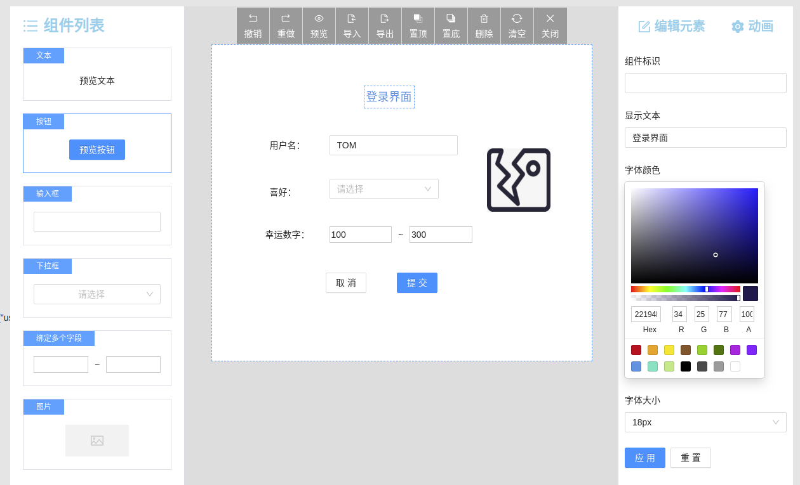

# Vite2 + React17 + Typescript4 + Ant Design 4 可视化拖拽页面编辑器

> 随着大前端的不断发展，越来越解放开发的双手，感觉要失业啦(^_^),针对一些简单模板处理，可直接通过个拖拉拽放，就可简单实现一些不错的 UI 功能。那么 `可视化拖拽页面编辑器` 的出现也是顺应时代的发展而出现。


***最终效果***




# 任务清单

- [X] 主页面结构：左侧菜单栏可选组件列表、中间容器画布、右侧编辑组件定义的属性；
- [X] 从菜单栏拖拽组件到容器；
- [X] 组件（Block）在容器的选中状态；
- [X] 容器内组件可移动位置；
- [X] 命令队列及对应的快捷键；
- [X] 容器内的组件单选、多选、全选；
- [X] 操作栏按钮：
    - [X] 撤销、重做 **重难点**；
    - [X] 置顶、置底；
    - [X] 删除、清空；
    - [X] 预览、关闭编辑模式；
    - [X] 导入、导出；
- [X] 右键菜单；
- [X] 拖拽粘性贴边；
- [X] 组件可以拖动调整高度和宽度（height，width）；
- [X] 组件可以设置预定好的属性（props）；
- [X] 组件绑定值（model）；  
- [X] 设置组件标识（soltName），根据这个标识，定义某个组件的行为（函数触发）和插槽的实现（自定义视图）;
- [X] 完善可选组件列表:
  - [X] 输入框：双向绑定值，调整宽度；
  - [X] 按钮：类型、文字、大小尺寸、拖拽调整宽高；
  - [X] 图片：自定义图片地址、拖拽调整图片宽高
  - [X] 下拉框：预定义选项值、双向绑定字段；


## 一、项目搭建与页面布局

1. 项目所需依赖：

```json
 "dependencies": {
    "@ant-design/icons": "^4.5.0",
    "antd": "^4.15.0",
    "classnames": "^2.2.6",
    "deepcopy": "^2.1.0",
    "react": "^17.0.1",
    "react-color": "^2.19.3",
    "react-dom": "^17.0.1"
  },
  "devDependencies": {
    "@types/classnames": "^2.2.11",
    "@types/node": "^14.14.37",
    "@types/react": "^17.0.2",
    "@types/react-color": "^3.0.4",
    "@types/react-dom": "^17.0.1",
    "@vitejs/plugin-react-refresh": "^1.3.1",
    "less": "^4.1.1",
    "sass": "^1.42.0",
    "typescript": "^4.1.5",
    "vite": "^2.0.1",
    "vite-plugin-babel-import": "^2.0.5",
    "vite-plugin-style-import": "^1.2.1"
  }
```

2. vite 配置

```js
const path = require('path');
import reactRefresh from '@vitejs/plugin-react-refresh';
import { defineConfig } from 'vite';
import styleImport from 'vite-plugin-style-import';

export default defineConfig({
    plugins: [
        reactRefresh(),
        styleImport({
            libs: [
                {
                    libraryName: 'antd',
                    esModule: true,
                    resolveStyle: (name) => {
                        return `antd/es/${name}/style`;
                    },
                }
            ]
        }),
    ],
    css: {
        preprocessorOptions: {
            less: {
                javascriptEnabled: true
            }
        }
    },
    esbuild: {
        jsxInject: "import React from 'react'", // 为每个 tsx jsx 自动引入 React，不用手动引入了
    },
    resolve: {
        alias: {
            "@": path.resolve(__dirname, "src"),
            "@assets": path.resolve(__dirname, "src/assets"),
            "@components": path.resolve(__dirname, "src/components")
        }
    },
    server: {
        https: false, // 是否开启 https
        open: true, // 是否自动在浏览器打开
        port: 3000, // 端口号
        host: "0.0.0.0",
        hmr: {
            overlay: true, // 是否开启错误的阴影层
        }
    },
    optimizeDeps: {
        include: [] // 第三方库
    },
    build: {
        chunkSizeWarningLimit: 2000,
        terserOptions: {
            // 生产环境移除 console
            compress: {
                drop_console: true,
                drop_debugger: true,
            },
        },
        rollupOptions: {
            output:{
                manualChunks: { // 分包
                    react: ['react', 'react-dom'],
                    antd: ['antd']
                }
            }
        }
    }
})
```


### 实现基本的左中右布局（三栏布局）

- 左侧是组件列表的菜单栏
- 中间是画布容器和顶部的工具栏，用来编辑和预览页面
- 右侧是对应画布容器中某个组件，对应显示的该组件的属性配置

这布局下相对简单就脑补吧 ^_^


## 二、基本数据结构设计

> 针对于一个画布容器与组件的关系，对应一个画布大小变化，和一个画布中对应多个组件，一个组件配置相关信息，对于拖拽大家一定想到，**定位**，如果优化，可以使用 CSS3 的属性 `transform` 的 `translateX`,` translateY`优化。这里暂时不做处理。

- 定义数据结构
  - container：画布容器信息
  - blocks：画布容器中的组件信息
  - blocks中存放每个 block 组件信息，包含了组件的唯一标识、位置、宽高、状态等信息

```tsx
/**
 * 容器中每个元素的的数据类型
 */
export interface VisualEditorBlock {
  componentKey: string, // component 对象的的 key 唯一标识
  top: number, // block 在容器中的 top 位置
  left: number, // block 在容器中的 left 位置
  width: number, // block 组件自身的宽度
  height: number, // block 组件自身的高度
  adjustPosition: boolean, // 添加组件到容器中时是否需要调整位置
  focus: boolean, // 组件是否是选中状态
  zIndex: number,   // block 组件元素的 z-index style 属性
  hasReasize: boolean, // block 组件元素是否曾调整国大小
  props?: Record<string, any> // block 组件元素右侧属性配置信息
  model?: Record<string, any> // 组件元素右侧自定义配置属性信息（绑定值）
  slotName?: string   // 组件标识
}
/**
 * 编辑器编辑的数据类型
 */
export interface VisualEditorValue {
  container: { // 画布容器
    height: number,
    width: number,
  },
  blocks: VisualEditorBlock[]
}
```

