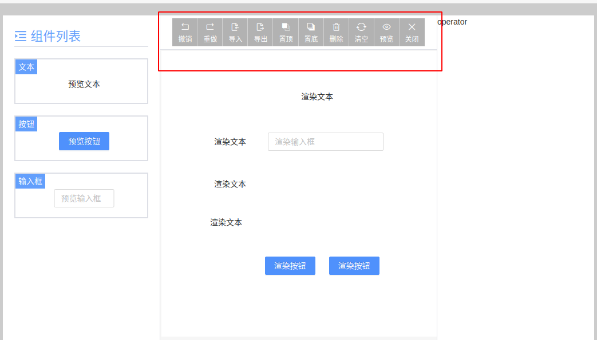

# Vite2 + React17 + Typescript4 + Ant Design 4 可视化拖拽页面编辑器

> 随着大前端的不断发展，越来越解放开发的双手，感觉要失业啦(^_^),针对一些简单模板处理，可直接通过个拖拉拽放，就可简单实现一些不错的 UI 功能。那么 `可视化拖拽页面编辑器` 的出现也是顺应时代的发展而出现。


***最终效果***


# 任务清单

- [X] 主页面结构：左侧菜单栏可选组件列表、中间容器画布、右侧编辑组件定义的属性；
- [X] 左侧菜单栏可选组件列表渲染；
- [x] 从菜单栏拖拽组件到容器；
- [x] 组件（Block）在容器的选中状态；
- [x] 容器内组件可移动位置；
- [X] 容器内的组件单选、多选、全选；
- [X] 命令队列及对应的快捷键；
- [ ] 操作栏按钮：
    - [X] 撤销、重做 **重难点**；
    - [X] 删除、清空；
    - [X] 预览、关闭编辑模式；
    - [ ] 置顶、置底；
    - [ ] 导入、导出；
- [ ] 右键菜单；
- [ ] 拖拽参考线；
- [ ] 组件可以拖动调整高度和宽度（height，width）；
- [ ] 组件可以设置预定好的属性（props）；
- [ ] 组件绑定值（model）；  
- [ ] 设置组件标识（soltName），根据这个标识，定义某个组件的行为（函数触发）和插槽的实现（自定义视图）;
- [ ] 完善可选组件列表:
  - [ ] 输入框：双向绑定值，调整宽度；
  - [ ] 按钮：类型、文字、大小尺寸、拖拽调整宽高；
  - [ ] 图片：自定义图片地址、拖拽调整图片宽高
  - [ ] 下拉框：预定义选项值、双向绑定字段；


# 一、项目搭建与页面布局

1. 项目所需依赖：

```json
 "dependencies": {
    "@ant-design/icons": "^4.5.0",
    "antd": "^4.15.0",
    "classnames": "^2.2.6",
    "deepcopy": "^2.1.0",
    "react": "^17.0.1",
    "react-color": "^2.19.3",
    "react-dom": "^17.0.1"
  },
  "devDependencies": {
    "@types/classnames": "^2.2.11",
    "@types/node": "^14.14.37",
    "@types/react": "^17.0.2",
    "@types/react-color": "^3.0.4",
    "@types/react-dom": "^17.0.1",
    "@vitejs/plugin-react-refresh": "^1.3.1",
    "less": "^4.1.1",
    "sass": "^1.42.0",
    "typescript": "^4.1.5",
    "vite": "^2.0.1",
    "vite-plugin-babel-import": "^2.0.5",
    "vite-plugin-style-import": "^1.2.1"
  }
```

2. vite 配置

```js
const path = require('path');
import reactRefresh from '@vitejs/plugin-react-refresh';
import { defineConfig } from 'vite';
import styleImport from 'vite-plugin-style-import';

export default defineConfig({
    plugins: [
        reactRefresh(),
        styleImport({
            libs: [
                {
                    libraryName: 'antd',
                    esModule: true,
                    resolveStyle: (name) => {
                        return `antd/es/${name}/style`;
                    },
                }
            ]
        }),
    ],
    css: {
        preprocessorOptions: {
            less: {
                javascriptEnabled: true
            }
        }
    },
    esbuild: {
        jsxInject: "import React from 'react'", // 为每个 tsx jsx 自动引入 React，不用手动引入了
    },
    resolve: {
        alias: {
            "@": path.resolve(__dirname, "src"),
            "@assets": path.resolve(__dirname, "src/assets"),
            "@components": path.resolve(__dirname, "src/components")
        }
    },
    server: {
        https: false, // 是否开启 https
        open: true, // 是否自动在浏览器打开
        port: 3000, // 端口号
        host: "0.0.0.0",
        hmr: {
            overlay: true, // 是否开启错误的阴影层
        }
    },
    optimizeDeps: {
        include: [] // 第三方库
    },
    build: {
        chunkSizeWarningLimit: 2000,
        terserOptions: {
            // 生产环境移除 console
            compress: {
                drop_console: true,
                drop_debugger: true,
            },
        },
        rollupOptions: {
            output:{
                manualChunks: { // 分包
                    react: ['react', 'react-dom'],
                    antd: ['antd']
                }
            }
        }
    }
})
```


### 实现基本的左中右布局（）

- 左侧是组件列表的菜单栏
- 中间是画布容器和顶部的工具栏，用来编辑和预览页面
- 右侧是对应画布容器中某个组件，对应显示的该组件的属性配置

这布局下相对简单就脑补一下下吧 ^_^


# 二、基本数据结构设计

> 针对于一个画布容器与组件的关系，对应一个画布大小变化，和一个画布中对应多个组件，一个组件配置相关信息，对于拖拽大家一定想到，**定位**，如果优化，可以使用 CSS3 的属性 `transform` 的 `translateX`,` translateY`优化。这里暂时不做处理。

- 定义数据结构
  - container：画布容器信息
  - blocks：画布容器中的组件信息
  - blocks中存放每个 block 组件信息，包含了组件的唯一标识、位置、宽高、状态等信息

```tsx
/**
 * 容器中每个元素的的数据类型
 */
export interface VisualEditorBlock {
  componentKey: string, // component 对象的的 key 唯一标识
  top: number, // block 在容器中的 top 位置
  left: number, // block 在容器中的 left 位置
  width: number, // block 组件自身的宽度
  height: number, // block 组件自身的高度
  adjustPosition: boolean, // 添加组件到容器中时是否需要调整位置
  focus: boolean, // 组件是否是选中状态
  zIndex: number,   // block 组件元素的 z-index style 属性
  hasReasize: boolean, // block 组件元素是否曾调整国大小
  props?: Record<string, any> // block 组件元素右侧属性配置信息
  model?: Record<string, any> // 组件元素右侧自定义配置属性信息（绑定值）
  slotName?: string   // 组件标识
}
/**
 * 编辑器编辑的数据类型
 */
export interface VisualEditorValue {
  container: { // 画布容器
    height: number,
    width: number,
  },
  blocks: VisualEditorBlock[]
}
```

[代码传送门](https://github.com/lyios8859-1/react-app-editor-project/commit/25575720ea2b1c13d6572ae8dad41ea1621fd5c5)


# 三、左侧菜单栏可选组件列表渲染

1. 开发注册组件

```tsx
// visual.config.tsx
import { Button, Input } from "antd";
import { createVisualConfig } from "./editor.utils";

export const visualConfig = createVisualConfig();

visualConfig.registryComponent('text', {
    label: '文本',
    preview: () => <span>预览文本</span>,
    render: () => <span>渲染文本</span>
});

visualConfig.registryComponent('button', {
    label: '按钮',
    preview: () => <Button>预览按钮</Button>,
    render: () => <Button type="primary">渲染按钮</Button>
});

visualConfig.registryComponent('input', {
    label: '输入框',
    preview: () => <Input placeholder="预览输入框" />,
    render: () => <Input placeholder="渲染输入框" />
});
```

**注册组件的函数**：

```tsx
/**
 * 创建编辑器的预设内容
 */
export function createVisualConfig() {
    // 用于 block 数据，通过 componentKey 找到 component 对象，使用 component 对象的 render 属性渲染内容到 container 容器里
    const componentMap: { [k: string]: VisualEditorComponent } = {};
    // 用户在 menu 中预定义的组件列表
    const componentList: VisualEditorComponent[] = [];

    const registryComponent = (key: string, options: Omit<VisualEditorComponent, 'key'>) => {
        // key 是唯一的
        if (componentMap[key]) {
            const index = componentList.indexOf(componentMap[key]);
            componentList.splice(index, 1);
        }
        const newComponent = {
            key,
            ...options
        }

        componentList.push(newComponent);
        componentMap[key] = newComponent;
    }

    return {
        componentList,
        componentMap,
        registryComponent
    }
}
```

2. 渲染注册的组件

```tsx
// VisualEditor.tsx

// 代码省略.....

export const VisualEditor: React.FC<{
  value: VisualEditorValue,
  config: VisualEditorConfig
}> = (props) => {

  return (<>
      <div className={styles['visual-editor__container']}>
          <div className={styles['visual-editor__menu']}>
              <div className={styles['visual-editor__menu__title']}>
                  <MenuUnfoldOutlined /> <span>组件列表</span>
              </div>
              {
                  props.config.componentList.map((component, index) => {
                      return (
                          <div key={component.key + '_' + index} className={styles['editor-menu__item']}>
                              <span className={styles['menu-item__title']}>{component.label}</span>
                              <div className={styles['menu-item__content']}>
                                  {component.preview()}
                              </div>
                          </div>
                      )
                  })
              }
          </div>
          <div className={styles['visual-editor__head']}>header</div>
          <div className={styles['visual-editor__operator']}>operator</div>
          <div className={styles['visual-editor__body']}>body</div>
      </div>
  </>);
};
```

***效果***


[代码传送门](https://github.com/lyios8859-1/react-app-editor-project/commit/25575720ea2b1c13d6572ae8dad41ea1621fd5c5)


# 四、block 组件画布容器区域渲染

1. block 组件

```tsx
// EditorBlock.tsx
export const VisualEditorBlock: React.FC<{
    block: VisualEditorBlockData,
    config: VisualEditorConfig,
    editing: boolean
}> = (props) => {
    const style = useMemo(() => {
        return {
            top: `${props.block.top}px`,
            left: `${props.block.left}px`,
        }
    }, [props.block.top, props.block.left]);

    const component = props.config.componentMap[props.block.componentKey];

    let render: any;
    if (!!component) {
        render = component.render({} as any);
    }

    return (() => {
        const mask = props.editing ? 'mask': '';
        return (
            <div className={`${styles['visual-editor__block']} ${mask}`.trim()} style={style}>
                {render}
            </div>
        )
    })()
}
```

2. block 组件的渲染

```tsx
// VisualEditor.tsx
export const VisualEditor: React.FC<{
  value: VisualEditorValue,
  config: VisualEditorConfig
}> = (props) => {
    // 代码省略.....

  const containerStyles = useMemo(() => {
    return {
      width: `${props.value.container.width}px`,
      height: `${props.value.container.height}px`,
    }
  }, [props.value.container.height, props.value.container.width]);
  return (<>
      {
        editing ? (
          <div className={styles['visual-editor__container']}>
              {/* // 代码省略..... */}
            <div className={styles['visual-editor__head']}>header <button onClick={methods.toggleEditing}>运行</button></div>
            <div className={styles['visual-editor__operator']}>operator</div>
            <div className={`${styles['visual-editor__body']} ${styles['custom-bar__style']}`}>
              <div className={styles['editor-body_container']} style={containerStyles}>
                {
                  props.value.blocks.map((block, index) => {
                    return <VisualEditorBlock
                            block={block}
                            config={props.config}
                            editing={editing}
                            key={index}
                          />
                  })
                }
              </div>
            </div>
          </div>
        ) : (
          <div className={styles['visual-editor__preview']}>
            <div className={styles['editor-preview__edit']} onClick={methods.toggleEditing}><Button>编辑</Button></div>
            <div className={styles['preview-edit__warpper']}>
              <div className={styles['editor-body_container']} style={containerStyles}>
                {
                  props.value.blocks.map((block, index) => {
                    return <VisualEditorBlock
                            block={block}
                            config={props.config}
                            key={index}
                            editing={editing}
                          />
                  })
                }
              </div>
            </div>
          </div>
        )
      }
  </>);
};
```

[代码传送门](https://github.com/lyios8859-1/react-app-editor-project/commit/b3df70f8a0b324ace90e28899c9d8f03c3f9df40)

***效果图***


# 五、左侧菜单组件拖拽到画布容器区域渲染

> 监听 html5 拖拽函数


```tsx
// VisualEditor.tsx

export const VisualEditor: React.FC<{
  value: VisualEditorValue,
  config: VisualEditorConfig,
  onChange: (val: VisualEditorValue) => void, // 数据有变化出发外部函数
}> = (props) => {
  // 当前是否处于编辑状态
  const [editing, setEditing] = useState(true);
  const methods = {
    // 切换编辑和运行状态
    toggleEditing () {
      setEditing(!editing);
    },
    /**
     * 更新 block 数据，触发视图重新渲染
     * @param blocks 
     */
    updateBlocks: (blocks: VisualEditorBlockData[]) => {
      props.onChange({
        ...props.value,
        blocks: [...blocks]
      })
    },
  }

  // 画布容器 DOM
  const containerRef = useRef({} as HTMLDivElement);

  const containerStyles = useMemo(() => {
    return {
      width: `${props.value.container.width}px`,
      height: `${props.value.container.height}px`,
    }
  }, [props.value.container.height, props.value.container.width]);

  //#region 左侧菜单拖拽到画布容器区域内
  const menuDraggier = (() => {

    const dragData = useRef({
      dragComponent: null as null | VisualEditorComponent // 左侧组件列表去拖拽的当前组件
    });

    const container = {
      dragenter: useCallbackRef((e: DragEvent) => {
        e.dataTransfer!.dropEffect = 'move';
      }),
      dragover: useCallbackRef((e: DragEvent) => {
        e.preventDefault();
      }),
      dragleave: useCallbackRef((e: DragEvent) => {
        e.dataTransfer!.dropEffect = 'none';
      }),
      drop: useCallbackRef((e: DragEvent) => {
        // 在容器画布添加组件
        console.log('add')

        methods.updateBlocks([
          ...props.value.blocks,
          createVisualBlock({
            top: e.offsetY,
            left: e.offsetX,
            component: dragData.current.dragComponent!
          })
        ]);

      }),
    };

    const block = {
      dragstart: useCallbackRef((e: React.DragEvent<HTMLDivElement>,  dragComponent: VisualEditorComponent) => {
        
        containerRef.current.addEventListener('dragenter', container.dragenter);
        containerRef.current.addEventListener('dragover', container.dragover);
        containerRef.current.addEventListener('dragleave', container.dragleave);
        containerRef.current.addEventListener('drop', container.drop);

        dragData.current.dragComponent = dragComponent;

      }),
      dragend: useCallbackRef((e: React.DragEvent<HTMLDivElement>) => {

        containerRef.current.removeEventListener('dragenter', container.dragenter);
        containerRef.current.removeEventListener('dragover', container.dragover);
        containerRef.current.removeEventListener('dragleave', container.dragleave);
        containerRef.current.removeEventListener('drop', container.drop);
      })
    };

    return block;
  })();
  //#endregion

  return (<>
      {
        editing ? (
          <div className={styles['visual-editor__container']}>
            {/* // 代码省略..... */}
            <div className={styles['visual-editor__head']}>header <button onClick={methods.toggleEditing}>运行</button></div>
            <div className={styles['visual-editor__operator']}>operator</div>
            <div className={`${styles['visual-editor__body']} ${styles['custom-bar__style']}`}>
              <div
                className={styles['editor-body_container']}
                style={containerStyles}
                ref={containerRef}
              >
                {
                  props.value.blocks.map((block, index) => {
                    return <VisualEditorBlock
                            block={block}
                            config={props.config}
                            editing={editing}
                            key={index}
                          />
                  })
                }
              </div>
            </div>
          </div>
        ) : (
         // 代码省略.....
        )
      }
  </>);
};
```

[代码传送门](https://github.com/lyios8859-1/react-app-editor-project/commit/a33d3799e3024b72fa213072a14928ae478dc63c)


# 六、画布容器中组件选中

> 是否选中，为每个元素组件绑定一个字段 focus 做判断处理，可以按住 `Shift` 选中多个，点击画布容器空白处，取消所有的选中状态。

```tsx
// VisualEditor.tsx

const methods = {
    /**
     * 更新 block 数据，触发视图重新渲染
     * @param blocks 
     */
    updateBlocks: (blocks: VisualEditorBlockData[]) => {
        props.onChange({
            ...props.value,
            blocks: [...blocks]
        })
    },
}
//#region 画布容器中 block 组件选中
const focusHandler = (() => {
    const mousedownBlock = (e: React.MouseEvent<HTMLDivElement>, block: VisualEditorBlockData, index: number) => {
        e.stopPropagation();
        if (preview) return;
        e.preventDefault();

        if (e.shiftKey) {
            // 如果摁住了shift键，如果此时没有选中的 block，就选中该 block，否则使该 block 的数据选中状态取反
            if (focusData.focus.length <= 1) {
                block.focus = true;
            } else {
                block.focus = !block.focus;
            }
            methods.updateBlocks(props.value.blocks);
        } else {
            // 如果点击的这个 block 没有被选中，才清空这个其他选中的 block，否则不做任何事情。放置拖拽多个 block，取消其他 block 的选中状态
            if (!block.focus) {
                block.focus = true;
                methods.clearFocus(block);
            }
        }

        setSelectIndex(block.focus ? index : -1);
        // 使用延时器保证，数据时渲染后的正确数据，否则有 BUG
        setTimeout(() => {
            blockDraggier.mousedown(e, block);
        });
    };
    const mousedownContainer = (e: React.MouseEvent<HTMLDivElement>) => {
        e.stopPropagation();
        if (preview) return;
        e.preventDefault();

        // 右键不作任何处理
        if (e.button === 1) return;
        // 判断不是点击了 container 容器就返回
        if (e.target !== e.currentTarget) return;

        // console.log('点击了 Contanier');
        if (!e.shiftKey) {
            // 点击空白出清空所有的选中的 block
            methods.clearFocus();
            setSelectIndex(-1);
        }
    };

    return {
        block: mousedownBlock,
        container: mousedownContainer
    }
})();
//#endregion
```

***效果图***


[传送门](https://github.com/lyios8859-1/react-app-editor-project/commit/539a99057735659c73bd34991d28591f5557b814)

# 七、选中的组件进行拖拽

> 多个选中也一起移动

```tsx
// VisualEditor.tsx

const methods = {
  /**
   * 更新 block 数据，触发视图重新渲染
   * @param blocks 
   */
  updateBlocks: (blocks: VisualEditorBlockData[]) => {
    props.onChange({
      ...props.value,
      blocks: [...blocks]
    })
  },
  /**
   * 清空选中的数据
   */
  clearFocus: (external?: VisualEditorBlockData) => {
    let blocks = [...props.value.blocks];
    if (!blocks.length) return;
    if (external) {
      blocks = blocks.filter(item => item !== external);
    }
    blocks.forEach(block => block.focus = false);
    methods.updateBlocks(props.value.blocks);
  },
}

//#region 画布容器组件的拖拽
  const blockDraggier = (() => {

    const [mark, setMark] = useState({x: null as null | number, y: null as null | number});

    // 存储拖拽时的数据
    const dragData = useRef({
      startX: 0, // 鼠标拖拽开始的，鼠标的横坐标
      startY: 0, // 鼠标拖拽开始的，鼠标的纵坐标
      startLeft: 0, // 鼠标拖拽开始的，拖拽的 block 横坐标
      startTop: 0, // 鼠标拖拽开始的，拖拽的 block 纵坐标
      startPosArray: [] as { top: number, left: number }[], // 鼠标拖拽开始的, 所有选中的 block 元素的横纵坐标值

      shiftKey: false, // 当前是否按住了 shift 键
      moveX: 0, // 拖拽过程中的时候, 鼠标的 left 值
      moveY: 0, // 拖拽过程中的时候, 鼠标的 top 值
      containerBar: {
        startScrollTop: 0, // 拖拽开始的时候, scrollTop 值
        moveScrollTop: 0, // 拖拽过程中的时候, scrollTop 值
      },
      
      dragging: false, // 当前是否属于拖拽状态
      markLines: { // 拖拽元素时，计算当前未选中的数据中，与拖拽元素之间参考辅助线的显示位置
        x: [] as {left: number, showLeft: number}[],
        y: [] as {top: number, showTop: number}[]
      }
    });
    const moveHandler = useCallbackRef(() => {
      if (!dragData.current.dragging) {
        dragData.current.dragging = true;
      }
      
      let {
        startX, 
        startY, 
        startPosArray, 
        moveX,
        moveY,
        containerBar,
        startLeft, 
        startTop, 
        markLines,
        shiftKey
      } = dragData.current;

      moveY = moveY + (containerBar.moveScrollTop - containerBar.startScrollTop);

      // 移动时, 同时按住 shift 键，只在一个方向移动
      if (shiftKey) {
        const n = 12; // 预定差值
        if (Math.abs(moveX - startX) > Math.abs(moveY - startY) + n) {
          moveY = startY;
        } else {
          moveX = startX;
        }
      }

      const durX = moveX - startX;
      const durY = moveY - startY;

      focusData.focus.forEach((block, index) => {
        const { left, top } = startPosArray[index];
        block.left = left + durX;
        block.top = top + durY;
      });
      methods.updateBlocks(props.value.blocks);

    });

    const scrollHandler = useCallbackRef((e: Event) => {
      dragData.current.containerBar.moveScrollTop = (e.target as HTMLDivElement).scrollTop;
      moveHandler();
    }); 

    const mousemove = useCallbackRef((e: MouseEvent) => {
      dragData.current.moveX = e.clientX;
      dragData.current.moveY = e.clientY;
      moveHandler();
    });
    const mouseup = useCallbackRef((e: MouseEvent) => {
      document.removeEventListener('mousemove', mousemove);
      document.removeEventListener('mouseup', mouseup);

      if (dragData.current.dragging) {
        dragData.current.dragging = false;
      }
    });
    const mousedown = useCallbackRef((e: React.MouseEvent<HTMLDivElement>, block: VisualEditorBlockData) => {
      
      document.addEventListener('mousemove', mousemove);
      document.addEventListener('mouseup', mouseup);
      
      dragData.current = {
        startX: e.clientX,
        startY: e.clientY,
        startLeft: block.left,
        startTop: block.top,
        startPosArray: focusData.focus.map(({ top, left }) => ({ top, left })),
        moveX: e.clientX,
        moveY: e.clientY,
        shiftKey: e.shiftKey,
        containerBar: {
          startScrollTop: 0,
          moveScrollTop: 0,
        },
        dragging: false,
        markLines: (() => {
          const x = [{ left: 0, showLeft: 0}];
          const y = [{ top: 0, showTop: 0}];
          return { x, y }
        })()
      }
    });
    return {
      mousedown,
      mark
    }
  })();
  //#endregion
```

[传送门](https://github.com/lyios8859-1/react-app-editor-project/commit/16eaacbbb1e9d682d8bfc972e4f5d45261870a09)

# 八、顶部操作栏

> 编辑的操作必要的一些删除，撤销，重做，导入，导出

```tsx
VisualEditor.tsx

//#region 功能操作栏按钮组
const buttons: {
  label: string | (() => string),
  icon: string | (() => string),
  tip?: string | (() => string),
  handler: () => void,
}[] = [
    {
      label: '撤销',
      icon: 'icon-back',
      handler: () => {
        console.log('撤销')
      },
      tip: 'ctrl+z'
    },
    {
      label: '重做',
      icon: 'icon-forward',
      handler: () => {
        console.log('重做')
      },
      tip: 'ctrl+y, ctrl+shift+z'
    },
    {
      label: '导入',
      icon: 'icon-import',
      handler: async () => {
        console.log('导入')
      }
    },
    {
      label: '导出',
      icon: 'icon-export',
      handler: () => {
        console.log('导出')
      }
    },
    {
      label: '置顶',
      icon: 'icon-place-top',
      handler: () => {
        console.log('置顶')
      },
      tip: 'ctrl+up'
    },
    {
      label: '置底',
      icon: 'icon-place-bottom',
      handler: () => {
        console.log('置底')
      },
      tip: 'ctrl+down'
    },
    {
      label: '删除',
      icon: 'icon-delete',
      handler: () => {
        console.log('删除')
      }, tip: 'ctrl+d, backspace, delete'
    },
    {
      label: '清空',
      icon: 'icon-reset',
      handler: () => {
        console.log('清空')
      }
    },
    {
      label: () => preview ? '编辑' : '预览',
      icon: () => preview ? 'icon-edit' : 'icon-browse',
      handler: () => {
        if (!preview && !editing) {
          methods.clearFocus();
        }
        innerMethods.togglePreview();
      },
    },
    {
      label: '关闭',
      icon: 'icon-close',
      handler: () => {
        if (!editing) {
          methods.clearFocus();
        }
        innerMethods.toggleEditing();
      }
    }
  ]
//#endregion

// 省略代码......

<div className={classModule['visual-editor__head']}>
  {
    buttons.map((btn, index) => {
      const label = typeof btn.label === "function" ? btn.label() : btn.label
      const icon = typeof btn.icon === "function" ? btn.icon() : btn.icon
      const content = (<div key={index} className={classModule['editor-head__button']} onClick={btn.handler}>
        <i className={`iconfont ${icon}`} />
        <span>{label}</span>
      </div>)
      return !btn.tip ? content : <Tooltip title={btn.tip} placement="bottom" key={index}>
        {content}
      </Tooltip>
    })
  }
</div>
```

***效果图***


[传送门](https://github.com/lyios8859-1/react-app-editor-project/commit/8e41eb0d2600331d4ea43231dc0b3a27b080cc22)

# 九、撤销，重做，删除、清空命令实现


- 基础命令初始化

```ts
// command.plugin.ts
import { useCallback, useRef, useState } from "react";

// command 的 execute 执行完之后，需要返回 undo、redo。execute 执行后会立即返回 redo，后续撤销的时候会执行 undo，重做的时候会执行 redo
interface CommandExecute {
    redo: () => void, // 默认执行，重做会调用
    undo?: () => void, // 撤销会调用
}

interface Command {
    name: string, // 命令的唯一标识
    execute: (...args: any[]) => CommandExecute, // 命令执行时候，所处理的内容
    keyboard?: string | string[], // 命令监听的快捷键
    followQueue?: boolean, // 命令执行之后，是否需要将命令执行得到的 undo，redo 存入命令队列（像全选、撤销、重做这中命令不需要存入命令队列的）
    init?: () => ((() => void) | undefined), // 命令初始化函数，如果返回的，则是一个销毁命令函数
    data?: any // 命令缓存所需的数据信息
}

export function useCommander() {

    const [state] = useState(() => ({
        current: -1, // 当前命令队列中，最后执行的命令返回的 CommandExecute 对象
        queue: [] as CommandExecute[], // 命令队列容器
        commandList: [] as { current: Command }[], // 预定义命令的容器
        commands: {} as Record<string, (...args: any[]) => void>, // 通过 command name 执行 command 动作的一个包装对象
        destroyList: [] as ((() => void) | undefined)[] // 所有命令在组件销毁之前，需要执行的消除副作用的函数容器
    }));

    /**
     * 注册命令
     */
    const useRegistry = useCallback((command: Command) => {
        const commandRef = useRef<Command>(command);
        commandRef.current = command;
        useState(() => {
            // 判断命令是否存在
            if (state.commands[command.name]) {
                const existIndex = state.commandList.findIndex(item => item.current.name === command.name);
                state.commandList.splice(existIndex, 1);
            }
            state.commandList.push(commandRef);
            // 对应命令的方法 AAAAAAA
            state.commands[command.name] = (...args: any[]) => {
                const { redo, undo } = commandRef.current.execute(...args);
                // 默认执行重做
                redo();
                // 如果命令执行后，不需要进入命令队列，就直接结束
                if (commandRef.current.followQueue === false) {
                    return;
                }
                // 否则，将命令队列中剩余的命令都删除，保留 current 及其之前的命令
                let { queue, current } = state;
                if (queue.length > 0) {
                    queue = queue.slice(0, current + 1);
                    state.queue = queue;
                }
                // 将命令队列中最后一个命令为i当前执行的命令
                queue.push({ undo, redo });
                // 索引加 1， 指向队列中的最有一个命令
                state.current = current + 1;
            }
            /**
             * commands 结构类型
             * {
             *   undo: () => {},
             *   redo: () => {}，
             *   delete: () => {},
             *   clear: () => {},
             *   placeTop: () => {},
             *   placeBottom: () => {}
             * }
             */

        });
    }, []);

    // 初始化注册命令（useRegistry）时的所有的 command 的 init 的方法
    const useInit = useCallback(() => {
        useState(() => {
            state.commandList.forEach(command => {
                command.current.init && state.destroyList.push(command.current.init());
            });
            // state.destroyList.push(keyboardEvent.init());
        });

        // 注册内置的撤回命令（撤回命令执行的结果是不需要进入命令队列的）
        useRegistry({
            name: 'undo',
            keyboard: 'ctrl+z',
            followQueue: false, // 标识不需要进入命令队列
            execute: () => {
                return {
                    redo: () => {
                        if (state.current === -1) return;
                        const queueItem = state.queue[state.current];
                        if (queueItem) {
                            queueItem.undo && queueItem.undo();
                            state.current--;
                        }
                    }
                }
            }
        });

        // 注册内置的重做命令（重做命令执行结果是不需要进入命令队列的）
        useRegistry({
            name: 'redo',
            keyboard: ['ctrl+y', 'ctrl+shift+z'],
            followQueue: false,
            execute: () => {
                return {
                    redo: () => {
                        const queueItem = state.queue[state.current + 1];
                        if (queueItem) {
                            queueItem.redo();
                            state.current++;
                        }
                    }
                }
            }
        });
    }, []);

    return {
        state,
        useInit,
        useRegistry
    }
}
```

- 扩展命令注册并导出

```tsx
// editor.command.tsx
import deepcopy from "deepcopy";
import { VisualEditorBlockData, VisualEditorValue } from "./editor.utils";
import { useCommander } from "./plugin/command.plugin";

export function useVisualCommand({
    focusData,
    value,
    updateBlocks
}: {
    focusData: {
        focus: VisualEditorBlockData[],
        unFocus: VisualEditorBlockData[]
    },
    value: VisualEditorValue,
    updateBlocks: (blocks: VisualEditorBlockData[]) => void,
}) {
    const commander = useCommander();

    // 注册一个删除命令操作
    commander.useRegistry({
        name: 'delete',
        keyboard: ['delete', 'ctrl+d', 'backspace'],
        execute: () => {
            const data = {
                before: (() => deepcopy(value.blocks))(),
                after: (() => deepcopy(focusData.unFocus))()
            }
            return {
                redo: () => { // 重做
                    updateBlocks(deepcopy(data.after));
                },
                undo: () => { // 撤销
                    updateBlocks(deepcopy(data.before));
                }
            }
        }
    });

    // 注册一个清空命令操作
    commander.useRegistry({
        name: 'clear',
        execute: () => {
            const data = {
                before: deepcopy(value.blocks),
                after: deepcopy([]),
            }
            return {
                redo: () => {
                    updateBlocks(deepcopy(data.after));
                },
                undo: () => {
                    updateBlocks(deepcopy(data.before));
                },
            }
        }
    })

     // 初始内置的命令 undo，redo
    commander.useInit(); // 在底部调用
    return {
        delete: () => commander.state.commands.delete(),
        clear: () => commander.state.commands.clear(),
        undo: () => commander.state.commands.undo(),
        redo: () => commander.state.commands.redo(),
    }
}
```

[传送门](https://github.com/lyios8859-1/react-app-editor-project/commit/c1e7102f40200eeda74fbc457491e7e76b5113fc)

# 十、绑定键盘快捷键事件

> 快捷键的组合处理函数

```ts
// command.plugin.ts

// 快捷键
const [keyboardEvent] = useState(() => {
  const onKeydown = (ev: KeyboardEvent) => {
    // 对于容器是否在空白区域或时操作某个组件的命令区分操作，比如空白区域时全选或全中所有的组件组件，在操作某个输入框组件时，全选就只会选中输入框中的文字
    if (document.activeElement !== document.body) {
        return;
    }
    const { keyCode, shiftKey, altKey, ctrlKey, metaKey } = ev;

    let keyString: string[] = [];

    if (ctrlKey || metaKey) {
        keyString.push('ctrl');
    }
    if (shiftKey) {
        keyString.push('shift');
    }
    if (altKey) {
        keyString.push('alt');
    }
    keyString.push(KeyboardCode[keyCode]);

    // 快捷键格式 'ctrl+alt+s'
    const keyNames = keyString.join('+');

    state.commandList.forEach(({ current: { keyboard, name } }) => {
        if (!keyboard) return;

        const keys = Array.isArray(keyboard) ? keyboard : [keyboard];

        if (keys.indexOf(keyNames) > -1) {
            state.commands[name](); // 执行对应的命令的方法 AAAAAAA
            ev.stopPropagation();
            ev.preventDefault();
        }
    })
}
```

[传送门](https://github.com/lyios8859-1/react-app-editor-project/commit/2e4d65ac7e696daadfb0cc0c7d0055b9e7d31d90)

# 十一、注册拖拽事件命令到命令队列中去

> 拖拽开始和结束都需要派发出事件（发布订阅的模式）

```ts
{
    const dragData = useRef({ before: null as null | VisualEditorBlockData[] });

    const handler = {
        // 拖拽开始或结束就会通过已经订阅的事件来触发这个 dragstart、dragend 函数，执行对应的函数逻辑
        dragstart: useCallbackRef(() => dragData.current.before = deepcopy(value.blocks)),
        dragend: useCallbackRef(() => commander.state.commands.drag())
    }
    /**
     * 注册拖拽命令
     * 适用于如下三种情况：
     * 1. 从左侧菜单拖拽组件到容器画布；
     * 2. 在容器中拖拽组件调整位置；
     * 3. 拖动调整组件的高度和宽度。
     */
    commander.useRegistry({
        name: 'drag',
        init: () => {
            dragData.current = { before: null };
            dragstart.on(handler.dragstart);
            dragend.on(handler.dragend);
            return () => {
                dragstart.off(handler.dragstart);
                dragend.off(handler.dragend);
            }
        },
        execute: () => {
            const data = {
                before: deepcopy(dragData.current.before),
                after: deepcopy(value.blocks)
            };
            return {
                redo: () => {
                    updateBlocks(deepcopy(data.after));
                },
                undo: () => {
                    updateBlocks(deepcopy(data.before) || []);
                }
            }
        }
    });
}
```

[传送门](https://github.com/lyios8859-1/react-app-editor-project/commit/5e28b64f19b8fd11ca1ad442eaef876258624500)