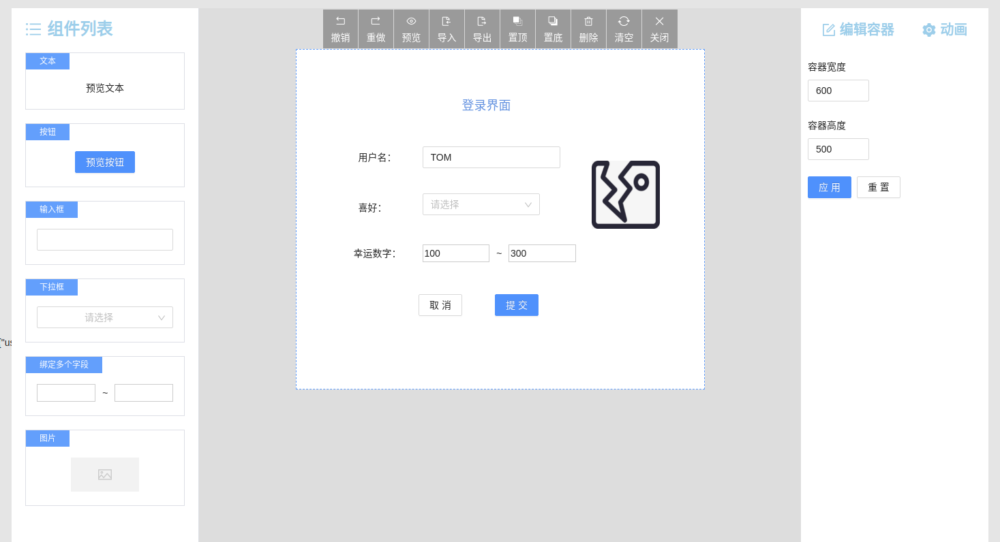

# Vite2 + React17 + Typescript4 + Ant Design 4 可视化拖拽页面编辑器

> 随着大前端的不断发展，越来越解放开发的双手，感觉要失业啦(^_^),针对一些可定制化的简单模板，可直接通过个拖拉拽放，就可简单实现一些不错的 UI 功能。那么 `可视化拖拽页面编辑器` 的出现也是顺应时代的发展而出现。

***最终效果***

# 任务清单

- [X] 主页面结构：左侧菜单栏可选组件列表、中间容器画布、右侧编辑组件定义的属性；
- [X] 从菜单栏拖拽组件到容器；
- [X] 组件（Block）在容器的选中状态；
- [X] 容器内组件可移动位置；
- [X] 命令队列及对应的快捷键；
- [X] 容器内的组件单选、多选、全选；
- [X] 操作栏按钮：
    - [X] 撤销、重做 **重难点**；
    - [X] 置顶、置底；
    - [X] 删除、清空；
    - [X] 预览、关闭编辑模式；
    - [X] 导入、导出；
- [X] 右键菜单；
- [X] 拖拽粘性贴边；
- [X] 组件可以拖动调整高度和宽度（height，width）；
- [X] 组件可以设置预定好的属性（props）；
- [X] 组件绑定值（model）；  
- [X] 设置组件标识（soltName），根据这个标识，定义某个组件的行为（函数触发）和插槽的实现（自定义视图）;
- [X] 完善可选组件列表:
  - [X] 输入框：双向绑定值，调整宽度；
  - [X] 按钮：类型、文字、大小尺寸、拖拽调整宽高；
  - [X] 图片：自定义图片地址、拖拽调整图片宽高
  - [X] 下拉框：预定义选项值、双向绑定字段；

